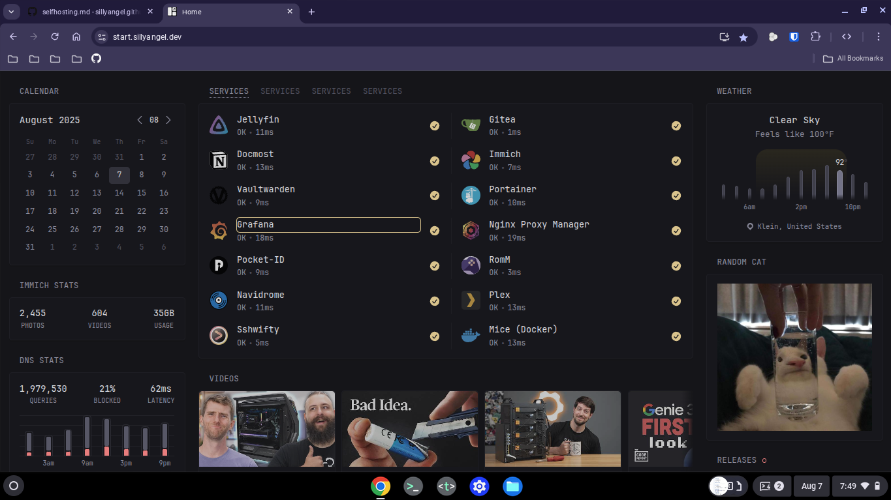

hello! in this post I’m going to talk about my experience with [self-hosting](https://wikipedia.com/wiki/Self-hosting_(web_services)), *my favorite topic*.  

It all started because of google photos’ 10gb limit.  
I used to make extra accounts just to get around it, but that got annoying fast.  
then I discovered [immich](http://immich.app/), its basically google photos you run yourself. the only catch is that **you** provide the storage and hardware. and that is when I started learning about Self-hosting.

I run everything on three raspberry pi 5’s (8gb, 4gb, and 2gb models), all of which I received through [highseas by hackclub](https://highseas.hackclub.com).
> highseas ended but you can join Summer of Making, you can start by joining at [https://summer.hack.club/b8t]

Below is an image of my glance/sh dashboard with all the services I host.  
you can check out my full setup at [start.sillyangel.dev](https://start.sillyangel.dev/):

after setting up immich in january 2025, I kept going — jellyfin & plex (my own netflix), vaultwarden (password & passkey manager), navidrome (my own spotify), and adguard home dns (network-wide ad/tracker blocker).  
> and those are **just** the ones I use every day.

Self-hosting can be hard, until you discover about docker 🤩; the best tool *ever*.  
in simple terms, docker is like running computers inside computers (kind of like virtual machines, but way lighter and wayyyyy simpler). for me, Self-hosting has become my new hobby, right alongside [programming](https://github.com/sillyangel), [listening to music](https://last.fm/users/sillyangel3), and playing video games.

I can’t wait to see what Self-hosting has in store for me in the future.
